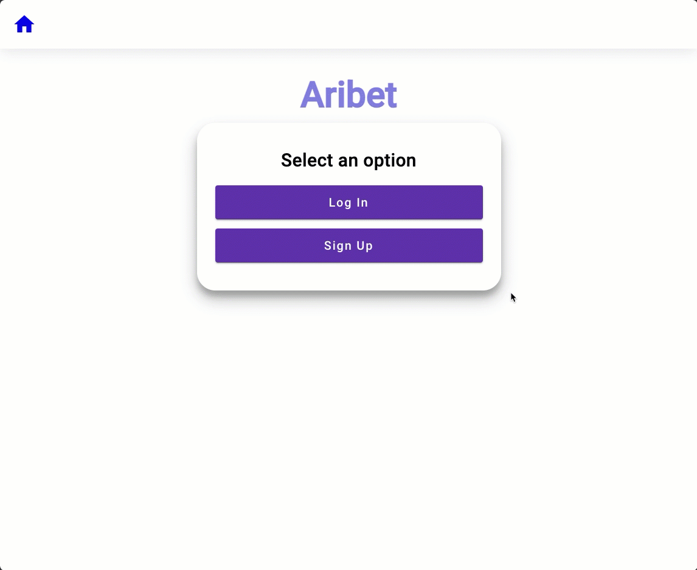

# Aribet Angular Frontend

This is the Angular frontend for the Aribet application, which interacts with the NestJS backend to provide a user interface for managing bets.

## Table of Contents

- [Introduction](#introduction)
- [Getting Started](#getting-started)
  - [Prerequisites](#prerequisites)
  - [Installation](#installation)
- [Usage](#usage)
- [Folder Structure](#folder-structure)
- [Dependencies](#dependencies)

## Introduction

Aribet is a betting application that allows users to create and view bets for a particular day. This Angular frontend provides a user-friendly interface for interacting with the Aribet API.

## Getting Started

### Prerequisites

Before you begin, ensure you have the following installed:

- Node.js (v14.x or later)
- Angular CLI (installed globally)

## Installation

1. Clone the repository:

```
git clone git@github.com:sirio-roberto/aribet-frontend-angular.git
```

2. Navigate to the Angular frontend directory:

```
cd aribet-frontend-angular
```

3. Install dependencies:

```
npm install
```

## Usage

To run the development server, use the following command:

```
ng serve
```

Visit `http://localhost:4200/` in your browser to access the Aribet Angular frontend.

## Folder Structure

The folder structure follows Angular's recommended project structure. Key directories include:

- `src/app`: Contains the Angular components, services, and other application-specific code.
- `src/assets`: Includes static assets like images, styles, etc.

## Dependencies

This project relies on several Angular and Material components. Key dependencies include:

- `@angular/core`
- `@angular/common`
- `@angular/forms`
- `@angular/material`

For a complete list, refer to the `package.json` file.

## Demo

### Creating account, bet and listing today's bets



### Setting today's result and showing winners


